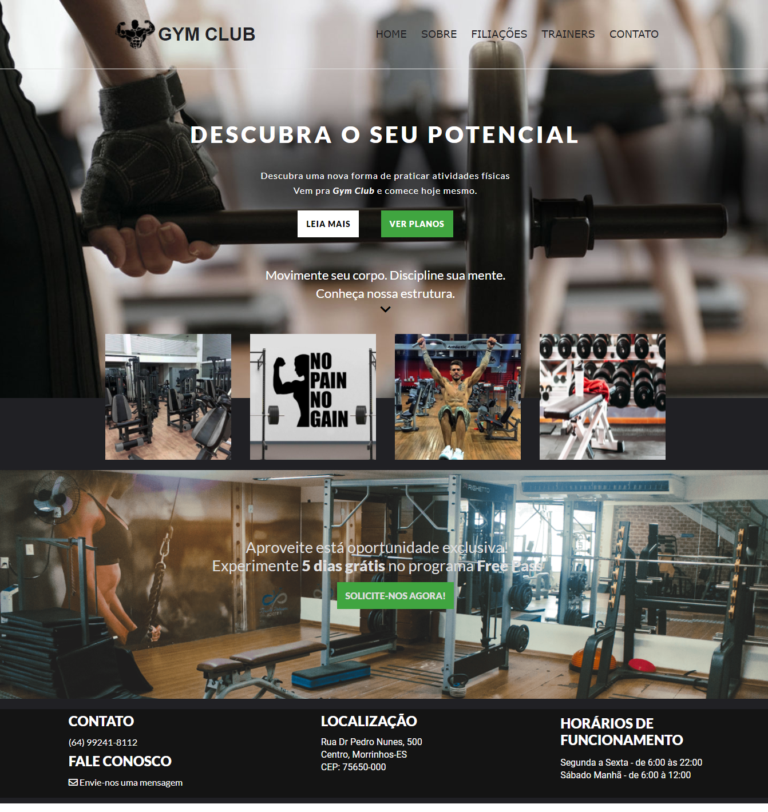

  <h2 style="text-align:center;">GYM CLUB💪</h2>

<strong>Sobre:🧾</strong> Projeto desenvolvido com o intuito de criar uma landpage para uma academia.

<h2>Tecnologias usadas: 👨‍💻</h2>
<ul>
  <li>HTML5</li>
  <li>CSS3</li>
</ul>

<h2>Site Completo:</h2>

Desenvolvido por <a href="https://github.com/Wiuver-Ribeiro">Wiuver Ribeiro 🙋‍♂️ </a>
